# Documentacion de Jenkin
## Contexto
> Desplegar Jenkins en un ambiente portable puede resultar en un desafío, ya que jennkins está pensado para ejecutar los Agentes con el entorno de Java ejecutándose como servicio.

> Este manual demuestra el despliegue de una arquitectura de jenkins portable, utilizando la tecnología Docker tanto para el servidor como para los agentes.

> Los agentes tienen configurado un Docker-In-Docker, lo que permitirá la creación de imágenes de Docker, además de contar con un agente SSH para manipular los repositorios de GIT.
## arquitectura de CI-CD para esta documentación
- > 1.- Dispositivo encargado de ejecutar Jenkins ( Servidor jenkins con IP: 10.30.0.14  y DOMINIO: jenkins.org.algo.com )
- > 2.- Dispositivo encargado de las tareas de Integración Continua ( Servidor CI conIP: 10.30.0.18 y DOMINIO: docker.org.algo.com)


## 1.- Crea el archivo docker-compose.yaml
- > En el servidor de jenkins (10.30.0.14) crea el siguiente archivo docker-compose.yaml, en el directorio ___/home/sica5/jenkins-CI-CD___
```YAML
version: '3'
services:
  jenkins:
    image: jenkins/jenkins:2.432
    container_name: jenkins-cicd
    restart: unless-stopped
    tty: true
    ports:
      - "8888:8080"
    volumes:
      - jenkins:/var/jenkins_home
      
volumes:
  jenkins:

```
- > Inicia los contenedores
```BASH
docker-compose up -d
```
## 2.- Acceder a Jenkins
> ⚠️ __***Para acceder a la consola de jenkins es recomendable que configures un nombre de dominio y un proxy inverso con certificado SSL***__
- >Accerde a https://jenkins.org.algo.com/ (Consola de jenkins)
- >Configura las extensiones recomendadas
- >Configura una contraseña SEGURA para ROOT
- >Instala Jenkisn con la instalación recomendada

## 3.- Configura el Agente de jenkins (CLOUD-SSH_AGENT)
> ⚠️ __***Para cada agente SSH debes generar un certificado y una llave diferente***__


> ⚠️ __***Cada CLOUD genera una llave y un certificado por sí solo***__

- >Crea el certificado y la llave para agente SSH
```BASH
# ssh-keygen -f ./jenkins_agent_key

Generating public/private rsa key pair.
Enter passphrase (empty for no passphrase): 
Enter same passphrase again: 
Your identification has been saved in ./jenkins_agent_key
Your public key has been saved in ./jenkins_agent_key.pub
The key fingerprint is:
SHA256:L2K8JSZrftDqpmbnT1+C/d6V78uXyTOQAEPCo3x1X2c cae@server8
The key's randomart image is:
+---[RSA 3072]----+
|      ....       |
|       o.+ .   .E|
|    . . o + . ...|
|     o .   . .   |
|     .. S   . .  |
|    ...o .   o . |
|    .oO = o   = o|
|  o =*.* = . ..B.|
| o.O=oo ..o .  +B|
+----[SHA256]-----+

```
Los archivos:
- > jenkins_agent_key: cópialos en una credencial de jennkins
- > jenkins_agent_key.pub: cópialos docker-compose del agente
### 3.1.- Inicia el Agente SSH jenkins y CLOUD
- >En el servidor agente (10.30.0.18) se crea el siguiente archivo docker-compose.yaml, en el directorio ___/home/cae/.caeS/jenkins-CI-CD___
```YAML
version: '3'
services:
  docker:
    image: docker:24-dind
    container_name: jenkins_agent_docker
    restart: unless-stopped
    privileged: true
    ports:
      - "2376:2376"
    volumes:
      - certs_ca:/certs/ca
      - certs_client:/certs/client
      - ./CI:/home/jenkins/agent/CI
    environment:
      - DOCKER_TLS_CERTDIR=/certs
      - DOCKER_TLS_SAN=DNS:docker.org.algo.com,DNS:pipeline.org.algo.com
  agent:
    image: jenkins/ssh-agent:alpine-jdk17
    container_name: jenkins_agent_ssh
    environment:
      - 'JENKINS_AGENT_SSH_PUBKEY=<jenkins_agent_key.pub>'
    volumes:
      - ./CI:/home/jenkins/agent/CI
    ports:
      - "2323:22"

volumes:
  certs_ca:
  certs_client:
```
> ⚠️ __***Copia el contenido de archivo jenkins_agent_key.pub en el apartado environment -> JENKINS_AGENT_SSH_PUBKEY***___
``` BASH
cat jenkins_agent_key.pub
```
```BASH
docker-compose up -d
```
> ⚠️ __***Obtén el contenido de los certificados y llave que crea DIND***___
- >Certificado de servidor
```BASH
sudo cat /var/lib/docker/volumes/jenkins-ci-cd_certs_ca/_data/cert.pem 
```
- >Certifiacdo de cliente
```BASH
sudo cat /var/lib/docker/volumes/jenkins-ci-cd_certs_client/_data/cert.pem
```
- >Llave del cliente
```BASH
sudo cat /var/lib/docker/volumes/jenkins-ci-cd_certs_client/_data/key.pem 
```
### 3.2.- Crea las credenciales para el CLOUD en jenkins
- > En la consola de jenkins ___***Dashboard>Manage Jenkins>Credentials>System>Global credentials>New credentials***___

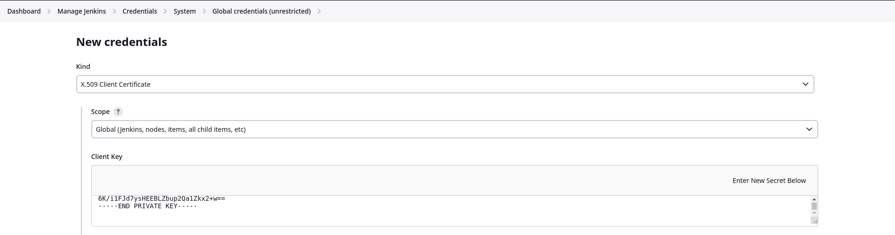
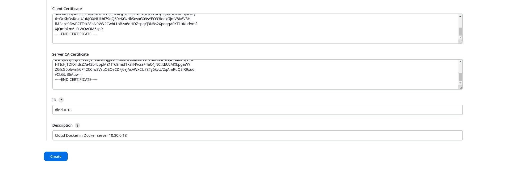

> ⚠️ ___***Copia el certificado del cliente, del servidor y la llave en los campos correspondientes***___
### 3.3.- Crea las credenciales para el agente  SSH de jenkins
- > En la consola de jenkins ___***Dashboard>Manage Jenkins>Credentials>System>Global credentials>New credentials***___

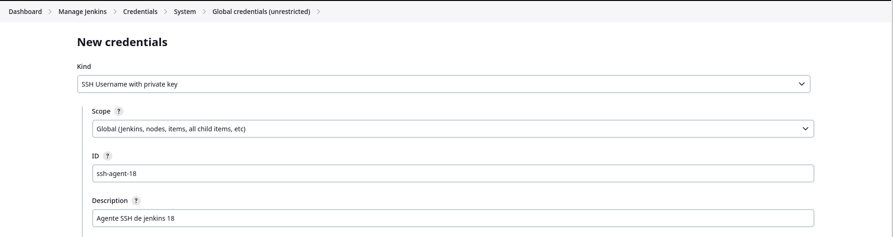
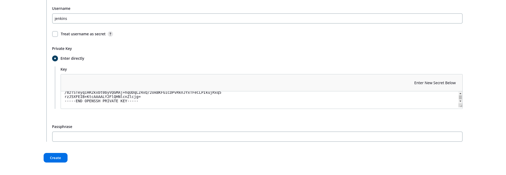

> ⚠️ ___***Copia la llave del agente SSH generado en el paso 3.1***___

## 4.0.- Configura el Agente SSH y CLOUD en el servidor de jenkins

### 4.1.- Crea el agente SSH de jenkins
- > En la consola de jenkins ___***Dashboard>Node>New node***___ 
- > Define un nombre de nodo y presiona ***create***

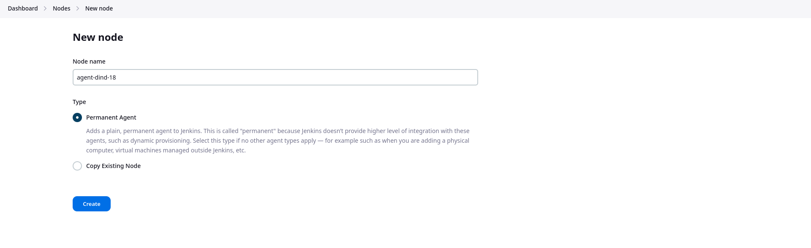
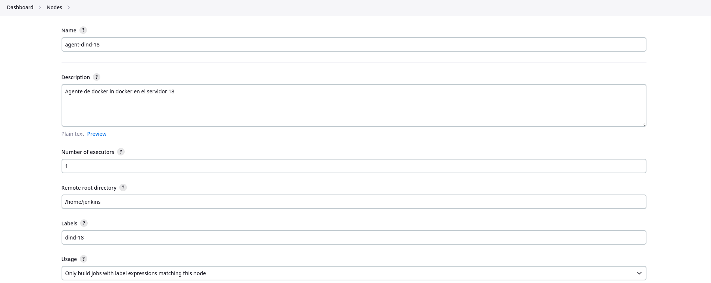
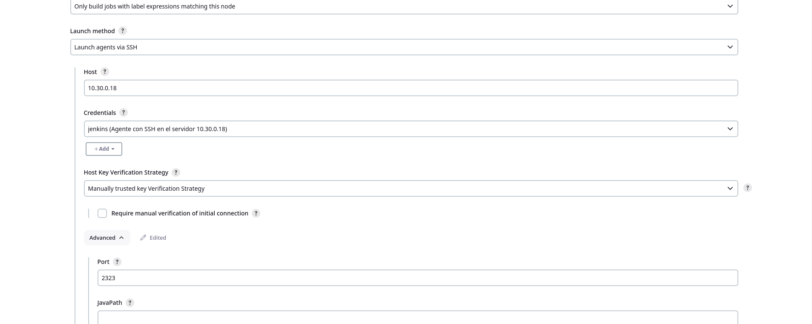
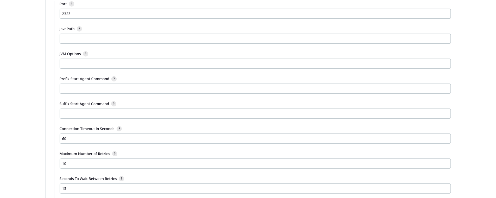
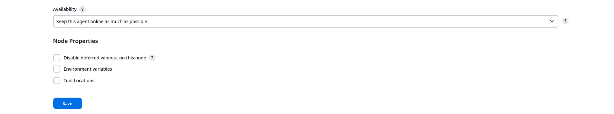

> ⚠️ ___***Elige las credenciales correspondientes para el agente de SSH***___

### 4.2.- Crea el CLOUD en el servidor de jenkins
- > En la consola de jenkins ___***Dashboard>Manage jenkins>Clouds>New cloud***___
- > Define un nombre de cloud y presiona ***create***

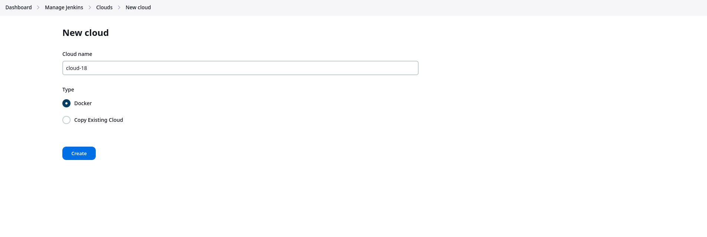
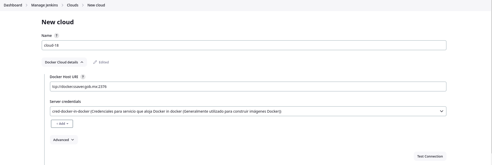
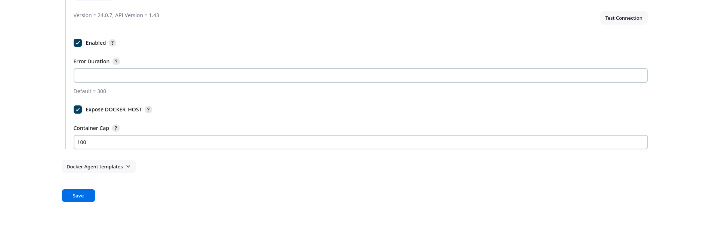
> ⚠️ ___***Asegurate de probar la conexión con el CLOUD***___

## 5.0.- Instala las extensiones necesarias para jenkins
- > En la consola de jenkins ___***Dashboard>Manage jenkins>Plugins>Available plugins***___

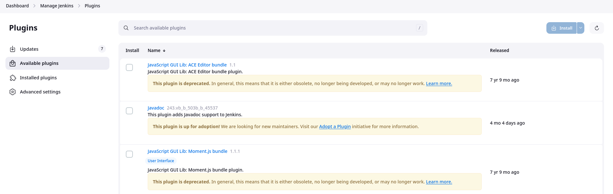
- > Busca e instala los siguientes paquetes
- - >Docker Pipeline
- - >Docker plugin
- - >SSH Agent Plugin

## 6.0 Creación de Pipelines para CI